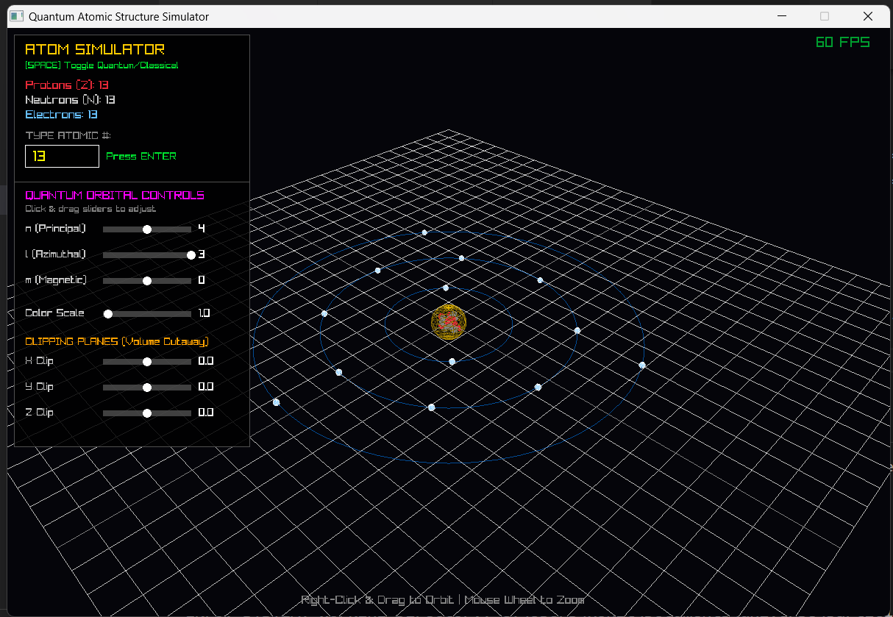
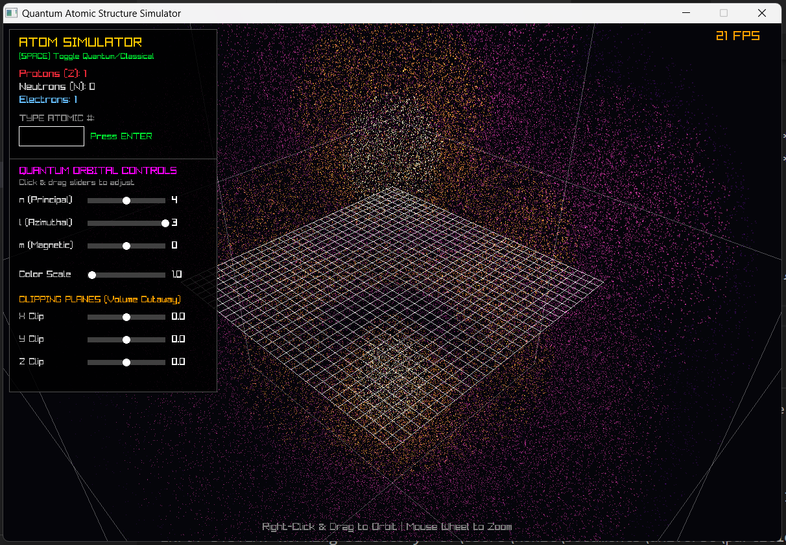

# Quantum Atomic Structure Simulator - Controls

Welcome to the interactive Quantum Atom Simulator. Below is the complete list of keyboard and mouse controls available to interact with the application.

## ⌨️ Keyboard Controls

| Key | Action | Description |
| :--- | :--- | :--- |
| **0 - 9** | Type Atomic Number | Enter the atomic number (Z) of the element you wish to build (e.g., `1` for Hydrogen, `6` for Carbon, `79` for Gold). |
| **Backspace** | Delete Digit | Deletes the last typed digit in the Atomic Number input box. |
| **Enter** | Build Atom | Applies the typed atomic number and instantly generates the corresponding atom and electron shells. |
| **Spacebar** | Toggle Quantum State | Switches the view between the **Classical State** (Bohr model with solid particles) and the **Quantum State** (Schrödinger wave probability cloud). |
| **F11** | Toggle Fullscreen | Switches the application window in and out of borderless fullscreen mode. |
| **Esc** | Exit | Closes the simulator application. |

## 🖱️ Mouse Controls

### Camera & Navigation (3D View)
* **Right-Click & Drag**: Orbit the camera. Hold down the right mouse button and move the mouse to rotate your view 360 degrees around the atomic core.
* **Scroll Wheel**: Zoom in and out. Scroll up to zoom closer to the nucleus, and scroll down to pull back and see the outer electron shells or broader probability cloud.

### UI Interaction (Quantum State Only)
When the simulator is in the **Quantum State** (toggle using `Spacebar`), an interactive HUD appears on the left side of the screen allowing you to manipulate the mathematical wave function.

* **Left-Click & Drag Sliders**: 
    * **`n` (Principal Quantum Number)**: Defines the overall size and energy level of the orbital (Range: 1 to 7).
    * **`l` (Azimuthal Quantum Number)**: Defines the shape/subshell of the orbital ($s, p, d, f$). Automatically constrained to never exceed $n-1$.
    * **`m` (Magnetic Quantum Number)**: Defines the 3D orientation of the orbital's lobes. Automatically constrained between $-l$ and $+l$.
    * **Color Scale**: Adjusts the visual intensity and brightness mapping of the probability cloud.
    * **Clipping Planes (X, Y, Z)**: Drag these sliders to slice through the 3D probability cloud dynamically. Setting them to `0` cuts a perfect quarter-section out of the atom to view the inner core layers.

## Screen shots

 

 

## 1. Classical Mechanics (Bohr Model)
When the simulator is in the "Observed" state, it renders particles as distinct physical spheres using the Bohr Model.

### Electron Shell Distribution (Rydberg Formula)
Electrons are distributed into discrete orbital shells ($n=1, 2, 3...$) based on the maximum capacity formula:
$$\text{Max Electrons per Shell} = 2n^2$$

### Orbital Velocity (Kepler/Coulomb Approximation)
In classical electrodynamics, inner electrons experience a stronger pull from the nucleus and orbit faster than outer electrons. The speed $v$ is approximated using the inverse-square law relationship:
$$v \propto \frac{1}{\sqrt{n}}$$
*(In code: `speed = 0.04f / sqrtf(shellIndex)`)*

### 2D Circular Orbit Position
The Cartesian coordinates $(x, z)$ for the orbiting electrons along a flat 2D plane are calculated using standard trigonometry, where $r$ is the orbital radius and $\theta$ is the current angle:
$$x = r \cdot \cos(\theta)$$
$$z = r \cdot \sin(\theta)$$
$$y = 0$$

---

## 2. Quantum Mechanics (Schrödinger Wave Equation)
When the simulator is in the "Unobserved" state, electrons exist as a wave of probability. The engine calculates the **Real Hydrogen-like Wavefunction** $\psi_{n,l,m}$ in real-time.

### The Probability Density
The probability of finding an electron at a specific point in space is the square of the wavefunction's magnitude:
$$P(r, \theta, \phi) = |\psi_{n,l,m}(r, \theta, \phi)|^2$$

The wavefunction is split into a **Radial component** $R(r)$ and an **Angular component** $Y(\theta, \phi)$:
$$\psi(r, \theta, \phi) = R_{n,l}(r) \cdot Y_{l,m}(\theta, \phi)$$

### The Radial Component $R(r)$
Determines the distance of the electron from the nucleus, generating the hollow "nodes" or rings. It utilizes **Associated Laguerre Polynomials** $L_k^\alpha(x)$. Let $\rho = \frac{2r}{n}$ (scaled distance):
$$R_{n,l}(\rho) = \rho^l \cdot e^{-\rho/2} \cdot L_{n-l-1}^{2l+1}(\rho)$$

### The Angular Component $Y(\theta, \phi)$
Determines the geometric shape (lobes) of the orbital using **Real Spherical Harmonics**, which rely on **Associated Legendre Polynomials** $P_l^m(x)$.
$$Y_{l,m}(\theta, \phi) = P_l^{|m|}(\cos\theta) \cdot \Phi(\phi)$$
Where the azimuthal rotation $\Phi(\phi)$ is defined as:
$$
\Phi(\phi) = 
\begin{cases} 
\cos(m\phi) & \text{if } m > 0 \\ 
1 & \text{if } m = 0 \\ 
\sin(|m|\phi) & \text{if } m < 0 
\end{cases}
$$

---

## 3. Computational Geometry & Rendering

### Spherical to Cartesian Coordinate Transformation
To render the quantum cloud, the mathematical spherical coordinates $(r, \theta, \phi)$ must be converted into 3D Cartesian space $(x, y, z)$ for the graphics engine:
$$x = r \cdot \sin(\theta) \cdot \cos(\phi)$$
$$y = r \cdot \cos(\theta)$$
$$z = r \cdot \sin(\theta) \cdot \sin(\phi)$$

### Monte Carlo Rejection Sampling
To generate the point cloud, we cannot just draw points everywhere (it would look like a solid cube). Instead, we use a probabilistic algorithm:
1. Generate a random point in 3D space.
2. Calculate the theoretical probability $P(x,y,z)$ at that exact location.
3. Generate a random test value $T$ between $0$ and the Maximum Probability.
4. **If $T < P(x,y,z)$**, the point is drawn. Otherwise, it is discarded.
*(To make the visual cloud appear thick and luminous, a Gamma Correction of $\sqrt{P}$ or $P^{0.4}$ is applied to the threshold).*

### 3D Point Rotation Matrix (Yaw)
To make the entire quantum cloud rotate majestically around the Y-axis without moving the camera, a 2D rotation matrix is applied to the $(x, z)$ coordinates of every particle at render time, where $A$ is the elapsed time angle:
$$x' = x \cos(A) - z \sin(A)$$
$$z' = x \sin(A) + z \cos(A)$$
$$y' = y$$